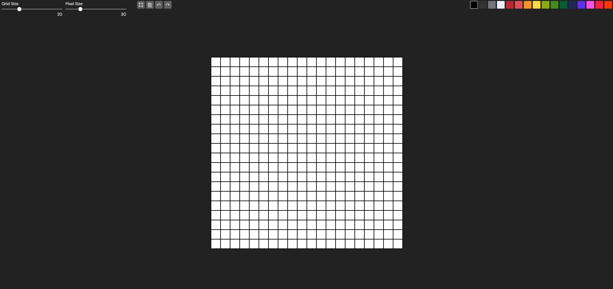

# 🎨 Pixel Painter

**Pixel Painter** is a simple yet fun web-based pixel art editor that allows users to create pixelated drawings. Built using HTML, CSS, and JavaScript, this project offers a minimalist and intuitive interface.

🔗 **Live Demo:** [Pixel Painter](https://pedroalves-dv.github.io/pixelpainter/)



## 📌 Features

✅ **Customizable Grid** – Adjust the canvas size for different pixel resolutions.  
✅ **Color Picker** – Select and apply colors to individual pixels.  
✅ **Generate Canvas** – Reset the grid or generate a new one after playing with grid settings. 
✅ **Save Artwork** – Download your pixel art as an image.  
✅ **Undo/Redo Functionality** – Effortlessly revert or reapply changes.  
✅ **Persistent Storage** – Saves progress using local storage.  

## 🛠️ Technologies Used

- **HTML**
- **CSS**
- **JavaScript**

## 🚀 Getting Started

### 1️⃣ Clone the Repository
```sh
 git clone https://github.com/pedroalves-dv/pixelpainter.git
 cd pixelpainter
```

### 2️⃣ Open `index.html`
Simply open the `index.html` file in your preferred web browser.

## 📌 Roadmap & Future Improvements
- 🎨 Add custom canvases, brushes 
- 🌟 More advanced export options (GIF, SVG, etc.)

## 🤝 Contributing
Contributions are welcome! Feel free to fork this repository and submit a pull request with enhancements or bug fixes.

## 📜 License
This project is licensed under the **MIT License** – feel free to use, modify, and distribute.

---

🔗 [GitHub](https://github.com/pedroalves-dv)  

